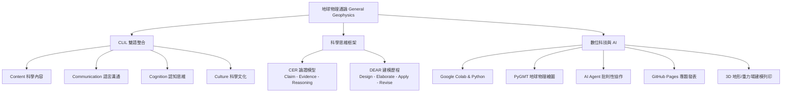

# 🌍 2026 臺北市立大學 地球環境暨生物資源學系
# 《地球物理通論》課程資源與第一堂課教學指引
## General Geophysics: Course Orientation, AI-assisted Inquiry, and Digital Workflow

[](https://github.com/)
[-green.svg)](https://github.com/)
[-red.svg)](https://www.utaipei.edu.tw/)
[](https://github.com/)
[](https://github.com/)

> **課程核心理念 / Core Philosophy**  
> 「我們用地球物理來學習地球，用英文來接觸科學，用 AI 來協助探索，但最後用自己的思考來理解世界。」  
> *“We use geophysics to study the Earth, English to access science, AI to support exploration, and our own thinking to understand the world.”*

---

## 📌 課程基本資訊 (Course Overview)

- **課程名稱**：地球物理通論 (General Geophysics)
- **授課學期**：第 115 學年度第 1 學期（2026 秋季學期）
- **開課單位**：臺北市立大學 地球環境暨生物資源學系（地生系二年級）
- **授課教師**：陳達毅 老師 (Dayi Chen)
- **授課模式**：任務導向學習（Task-Based Learning）、雙語教學（CLIL / EMI）、AI 輔助探究、雲端運算與數位建模實作

---

## 💡 核心教學架構與理念 (Core Frameworks)

本課程並非傳統填鴨式學科知識記憶，而是將**地球物理學科知識**、**科學英語表達**與**現代資訊/AI技能**三位一體整合，強調「像科學家一樣思考與研究」：



### 1. CLIL 雙語整合學習 (Content and Language Integrated Learning)
- **目標**：不是學文法或為了學英文而學英文，而是學會使用英文作為**獲取新知、描述現象、呈現證據與學術溝通**的工具。
- **4C 架構**：
  - **Content (內容)**：震測、重力、地磁、地電、地熱與板塊構造。
  - **Communication (溝通)**：專有名詞、科學論述句型、中英文對照報告。
  - **Cognition (認知)**：觀察、假設、驗證、批判性評估與模型修正。
  - **Culture (文化)**：開放資料（Open Data）、協作分享、可重現性（Reproducibility）。

### 2. 科學探究與論證框架 (CER & DEAR)
- **CER 論證結構**：
  - **Claim (主張)**：我對現象的看法與假說是什麼？
  - **Evidence (證據)**：我有什麼觀測數據或圖表能支持主張？
  - **Reasoning (推理)**：如何運用物理原理將證據與主張連結起來？
- **DEAR 建模循環**：
  - **D (Design)**：設計初始簡化模型。
  - **E (Elaborate)**：加入更多觀測數據與約束條件，精緻化模型。
  - **A (Apply)**：運用模型進行推論與預測新現象。
  - **R (Revise)**：發現反例與不符處時，反思並修正模型。

### 3. AI 協作與素養 (AI Literacy & Critical Thinking)
- **AI 是協作者而非代寫者**：使用 Gemini、Codex、Antigravity、OpenCode 輔助分析與除錯。
- **核心守則**：「AI 可以產生答案，但理解與判斷答案是你的責任。」
- **AI Interaction Log**：學生須完整記錄提問 Prompt、AI 回覆、自主懷疑與批判、資料驗證方式及模型修正歷程。

---

## 📂 專案檔案清單與說明 (Repository Contents)

本專案收錄第 1 週開學完整的教學簡報、開場雙語口白講稿、3小時課堂逐字稿與 CLIL 句型附錄：

| 檔案名稱 | 說明與主要內容 | 適用對象 / 用途 |
|---|---|---|
| [地球物理通論_第一堂課_PPT詳細版.md](file:///c:/Users/utaipei/Downloads/2026_Utaipei_Geophysics_0909/地球物理通論_第一堂課_PPT詳細版.md) | **Marp 格式完整教學投影片（16:9）**<br>涵蓋 18 週學習地圖、任務 1~8 逐步指引、CER/DEAR 解說、評量標準、專題網站結構及課堂管理附錄。 | 教師授課簡報、課後複習、Marp 轉投影片 |
| [地球物理通論第一堂課｜3小時中英文對照完整講稿.md](file:///c:/Users/utaipei/Downloads/2026_Utaipei_Geophysics_0909/地球物理通論第一堂課｜3小時中英文對照完整講稿.md) | **第一堂課 3 小時全時段雙語完整講稿**<br>依時間軸（09:00–12:00）劃分 8 大任務之教師中英對照逐字稿、黑板板書架構與時間管理。 | 教師授課口播參考、EMI/CLIL 課堂指導 |
| [地球物理第一次上課_中英對照講稿.md](file:///c:/Users/utaipei/Downloads/2026_Utaipei_Geophysics_0909/地球物理第一次上課_中英對照講稿.md) | **雙語開場理念與 CER 思考講稿精簡版**<br>深入淺出介紹為何用英文學科學、以地震與板塊構造為例示範 CER 循環與 AI 協作角色。 | 學生課前導讀、精簡版開場講稿 |
| [地球物理通論第一堂課｜CLIL句型與三例擴充附錄.md](file:///c:/Users/utaipei/Downloads/2026_Utaipei_Geophysics_0909/地球物理通論第一堂課｜CLIL句型與三例擴充附錄.md) | **CLIL 核心句型與三例擴充句庫（Sentence Bank）**<br>包含 Level 1~8 漸進句型、CER/DEAR 專用句、AI Prompt 句型、小組討論常用語與「科學論述六句組」。 | 學生撰寫作業、小組討論、報告發表小抄 |

---

## 🗺️ 18 週學習路線圖 (18-Week Roadmap)

```text
Week 01 ─── 課程導航、任務模式、系統安裝 (GitHub / Colab / AI)
Week 02 ─── PyGMT 繪製全球地形與板塊邊界圖
Week 03-04 ─ 板塊構造與地形 3D 建模列印
Week 05 ─── 校園野外實驗：折射震測探勘實地量測
Week 06-07 ─ 折射震測原理、走時曲線走線與模型建立
Week 08 ─── 期中檢核 (40%)
Week 09-10 ─ 重力探勘、地下密度異常分析與 Geoid 3D 建模
Week 11 ─── 專家專題演講（學界/業界連結）
Week 12 ─── 地熱流分析與板塊構造能源
Week 13-14 ─ 地電與地磁方法（電阻率、海底擴張地磁條帶）
Week 15-16 ─ 期末專題 GitHub Pages 雙語成果公開發表
Week 17-18 ─ 校外實習與業界/研究機構參訪
```

---

## 📊 評量方式 (Grading Policy)

| 項目 | 比例 | 評量依據與重點 |
|---|:---:|---|
| **期中考** | **40%** | 地球物理基礎理論（震測、重力、地磁、板塊運動）之觀念理解與推導應用。 |
| **實作與專題作業** | **50%** | Google Colab 程式實作、PyGMT 視覺化地圖、AI 探究互動紀錄 (AI Log)、CER 論證與 DEAR 模型修正歷程、GitHub Pages 專題網站成果。 |
| **平時成績** | **10%** | 課堂參與、小組合作互動、提問討論、Exit Ticket 繳交。 |

> ⚠️ **評量核心精神**：評分不僅重視「最終答案」，更重視**思考探究的歷程、對 AI 輸出的驗證態度與模型的迭代修正能力**。

---

## 🚀 第一堂課任務清單 (Week 1 Onboarding Tasks)

下課前每位同學與小組需依序確認完成以下 8 項任務：

1. **分組建立**：2–3 人一組，推選組長，分配初期角色（`Data/Code`、`Explanation/CLIL`、`Design/Web/3D`）。
2. **GitHub 設定**：註冊 GitHub 帳號，建立個人或小組儲存庫 `geophysics-learning-2026`。
3. **Colab 啟動**：開啟 Google Colab，建立首個筆記本 `Week01_Geophysics_First_Inquiry.ipynb` 並成功執行 Python 測試程式碼。
4. **AI 認識與探究**：在 Gemini / Codex 中進行第一階段「全球地震、火山與海溝分布」之引導式提問（不直接索取標準答案）。
5. **CER 萃取**：將 AI 與個人的分析整理為 Claim、Evidence、Reasoning 格式。
6. **DEAR 建模**：整理 Design（初模）、Elaborate（精煉）、Apply（推論）、Revise（修訂）的歷程。
7. **AI Log 存檔**：完整保存 Prompt 與查證反思，整理為規範的 Markdown 格式。
8. **Exit Ticket 繳交**：完成課堂末 3 句自我檢核回饋。

---

## 🗣️ CLIL 必備科學思考句型 (Essential CLIL Sentence Bank)

為協助同學順利完成中英文雙語作業與期末口頭發表，推薦熟練掌握以下精選句型：

### 🎯 科學論述六句組 (Six-Sentence Scientific Argument)
1. **Observation**：`We observe that [phenomenon].`（我們觀察到……）
2. **Question**：`We want to know why [phenomenon occurs].`（我們想探究為什麼……）
3. **Hypothesis**：`We hypothesize that [explanation].`（我們假設……）
4. **Prediction**：`If our hypothesis is correct, we expect [prediction].`（若假說正確，我們預期……）
5. **Evidence**：`The evidence shows that [data pattern].`（證據與資料顯示……）
6. **Conclusion/Revision**：`Therefore, we support / revise our model.`（因此我們支持／修正我們的模型。）

### 🤖 AI 批判協作核心語句 (AI Verification Patterns)
- `Do not give me the final answer directly. Guide me step by step.`（不要直接給我最終答案，請一步步引導我思考。）
- `AI suggested that [...], but we verified it by [...].`（AI 建議了……，但我們透過……進行了驗證。）
- `AI can generate an answer, but understanding the answer is your responsibility.`（AI 可以產出答案，但理解與判斷答案是你的責任。）

---

## 🛠️ 開發與使用指引 (Usage & Contributing)

### 投影片預覽與匯出 (Marp)
本專案的 `地球物理通論_第一堂課_PPT詳細版.md` 為標準 Marp Markdown 格式。若要在 VS Code 或編輯器中播放或匯出投影片：
1. 安裝 VS Code 套件：`Marp for VS Code`。
2. 開啟該檔案，點擊右上角「Marp Preview」即可全螢幕預覽。
3. 點擊 Marp 匯出圖示，可直接輸出為 **PDF** 或 **HTML 網頁簡報**。

---

## 👨‍🏫 授課師資與版權資訊 (Instructor & License)

- **授課教師**：陳達毅 博士 / 助理教授
- **教學單位**：臺北市立大學 地球環境暨生物資源學系
- **研究領域**：地震測報、地震預警系統、地球物理資料分析、AI 輔助科學教育
- **教材授權**：本課程教材遵循學術教學與教育共享原則，僅供臺北市立大學師生教學與學術研究使用。引用或改編請註明出處。
